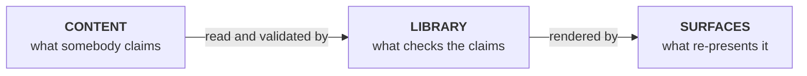
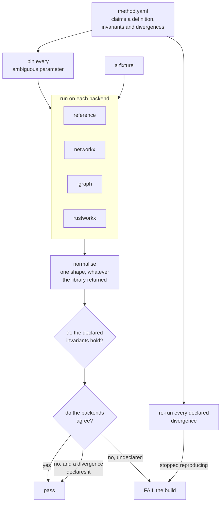
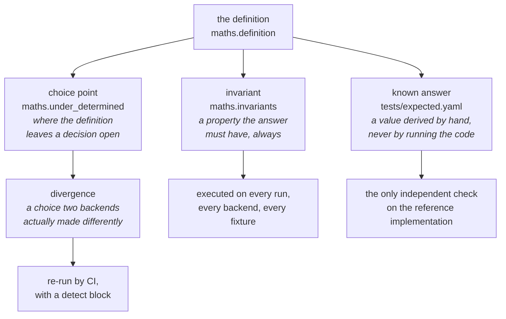
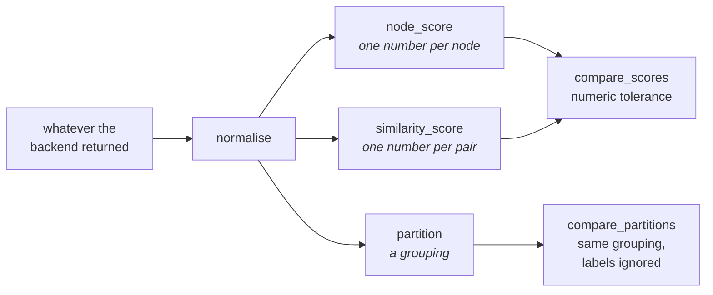
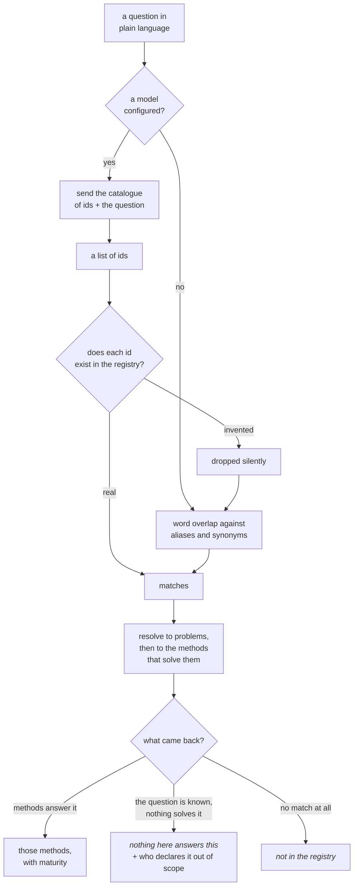
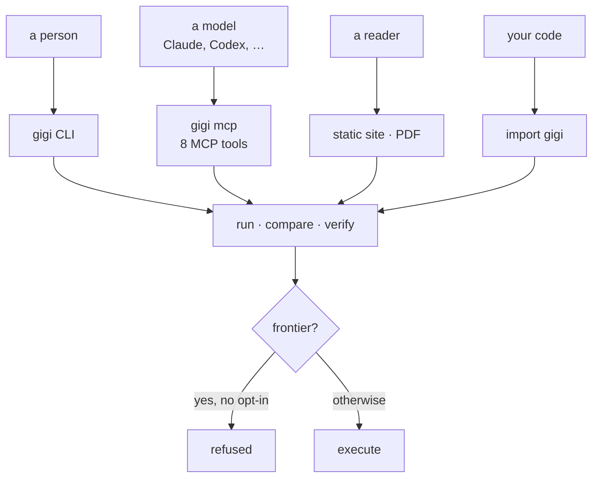
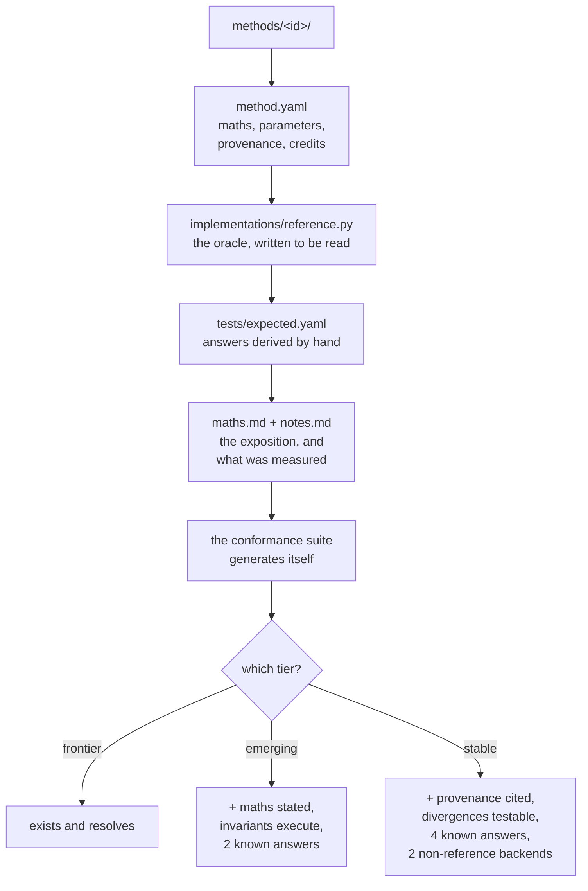

# How Gigi works

Gigi is a registry of what analytical methods *mean*, and a harness that checks those claims against the libraries that implement them. This document is the shape of the thing: what the pieces are, how a question travels through them, and why the boundaries sit where they do.

If you want to read the code, [CODEBASE.md](CODEBASE.md) has a reading order. If you want to add a method, [CONTRIBUTING.md](../CONTRIBUTING.md) is the one to open. This is the map you look at before either.

## The one-sentence version

**Content makes claims; the harness checks them; the surfaces re-present what was checked.** Nothing in the middle layer invents an answer, and nothing in the outer layer computes one.

| layer | what is in it | what it may do |
|---|---|---|
| **content** | `methods/*/method.yaml` (the maths, parameters, recorded divergences), `methods/*/implementations/` (reference plus one per backend), `datasets/*/` (small adversarial fixtures), `problems/` · `families/` · `domains/`, `people/people.yaml` | make claims |
| **library** | `registry.py` (a directory becomes a `MethodSpec`), `data.py` (one door, any dataset kind), `backends/` (convert to each library's shape), `harness.py` (run · compare · verify), `results.py` + `invariants.py` (is this the same answer? is the maths true?) | check claims |
| **surfaces** | `cli/` (a terminal), `site/` + `typst.py` (a browser, a PDF), `agent/` (MCP tools for a model) | re-present what was checked |

The three layers are enforced, not merely intended. `tests/test_readability.py` counts **capability** (the library) separately from **reporting** (the surfaces), and the library has to grow more slowly than the registry does — the claim being that *adding a method is content, not code*.

## The core loop: `gigi verify`

This is the argument the whole project makes. Everything else is scaffolding around it.

Two independent questions, deliberately not mixed:

1. **With every ambiguous parameter pinned, do the backends agree?** Any disagreement must be named by a declared divergence, or verification fails.
2. **Does each declared divergence still reproduce?** A divergence that stopped happening is stale documentation, and that fails too.

That second one is what makes a divergence a claim rather than a comment. `method.yaml` says *networkx and igraph differ on this fixture under these parameters*, and CI re-runs it on every commit.

## Where the arguments live

A method is under-determined in more places than people expect, and the registry has a slot for each kind of uncertainty. They are different things and get different treatment:

- A **choice point** is derived from the maths: *here the definition does not say*. It can exist before anyone has run anything.
- A **divergence** is measured: *here two libraries actually differ*. It must name a choice point, and carry an executable `detect:` block.
- An **invariant** must name a real check in `gigi/invariants.py`, or the build fails. A property written down and never executed is a comment.
- A **known answer** must say how it was *derived*. "I ran it" is not a derivation — a case obtained by running the code checks the code against itself.

## What a result is

Gigi compares answers, not bytes. Two backends can be identically correct and return different types, orderings and floating-point noise, so "the same answer" is declared per output kind and implemented in one place.

`node_score` and `similarity_score` share a comparator because the comparison genuinely is identical — one number per key, judged by tolerance. Only the meaning of the key differs.

`partition` could not share it. Four backends label components four different ways — igraph counts in reverse topological order, rustworkx in reverse index order — so comparing labels would report four correct implementations as four different answers. The comparator compares groupings.

**The rule with teeth:** a new output kind must ship a comparator before any method may claim it. A kind without one describes a method nothing can verify, which is the failure this project exists to avoid.

## Asking it something

`gigi ask` answers from the registry and nothing else. A model may help *find* the right entries; it never writes a word anyone reads. Its selection is a recommendation, not a verified claim, so the CLI shows how each answer was matched.

The safety property is that the answer space is **enumerable and checkable**. A model picks from a closed catalogue and every id is looked up; anything invented is dropped. It can still choose an irrelevant real entry, so matching is visible and reviewable rather than treated as proof. Every failure — no key, no network, unparseable reply, every id invented — degrades to word matching, so `gigi ask` works offline.

The two right-hand outcomes matter more than the first. *"Nothing here answers this"* is a true and useful answer, and the alternative — offering the nearest method — is exactly the mistake the registry documents.

## Who calls what

The same three functions serve every caller. There is no second code path, which is why a guarantee proved in one surface holds in all of them.

The maturity gate sits **inside** the harness rather than in each surface, so every caller inherits it. An agent is not a special case — which is the one place it would have been tempting to make one.

## Adding a method

The path a contributor walks, and what each step costs:

A contributor writes YAML and one readable Python file. They write no tests: the conformance suite is generated from the registry, so adding a directory gets every check for free. The maturity ladder is priced in `gigi/requirements.py` — one list, so `gigi review`, the test suite and CONTRIBUTING.md cannot drift into three different opinions about what `stable` means.

## The boundaries, and why they are there

| boundary | enforced by | what it prevents |
|---|---|---|
| content vs library | the capability budget, and capability-per-method | the library growing with the content — adding a method must be content, not code |
| library vs surfaces | the same buckets, counted separately | a CLI that starts computing rather than formatting |
| a claim vs a check | invariants must name a check; divergences must have a `detect` block | a registry of comments nobody runs |
| the definition vs an implementation | choice points, and pinned parameters in verification | mistaking a library's convention for the maths |
| finding vs asserting | validated ids; the registry supplies every word | a generated sentence that looks exactly like a verified one |

That last row is the one to keep hold of. Everything here is verified — divergences re-run, invariants executed, known answers derived by hand — and the value of that collapses the moment something unverified is presented in the same voice.
